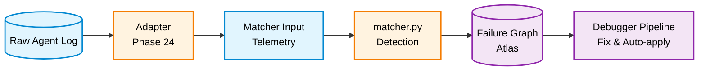

# agent-failure-debugger

A deterministic pipeline that diagnoses, explains, and fixes failures in LLM-based agent systems.

```
Detection tells you WHAT failed.
This tool tells you WHY — through which causal path, starting from which root.
And then fixes it.
```

---

## Related Repositories

| Repository | Role |
|---|---|
| [llm-failure-atlas](https://github.com/kiyoshisasano/llm-failure-atlas) | Failure pattern definitions, causal graph, matcher, evaluation, KPI |
| [agent-pld-metrics (PLD)](https://github.com/kiyoshisasano/agent-pld-metrics) | Behavioral stability framework this tool applies to |

---

## What It Does

**Input:** Matcher output (detected failures with confidence scores) + causal graph

**Output:**
- Root cause identification with causal ranking
- Full causal path reconstruction
- Deterministic fix generation with safety classification
- Confidence-gated auto-apply with rollback
- Learning-aware priority adjustment

---

## Quickstart

```bash
git clone https://github.com/kiyoshisasano/agent-failure-debugger.git
cd agent-failure-debugger
pip install -r requirements.txt
```

Run with sample data:

```bash
# Diagnosis only
python main.py ../llm-failure-atlas/examples/simple/matcher_output.json

# Full pipeline (recommended)
python pipeline.py ../llm-failure-atlas/examples/simple/matcher_output.json --use-learning
```

Output:

```
=== PIPELINE RESULT ===
  Root cause:  premature_model_commitment (confidence: 0.85)
  Failures:    3
  Fixes:       1
  Gate:        auto_apply (score: 0.9218)
  Applied:     no
```

---

## Use as an API

```python
from pipeline import run_pipeline
import json

with open("matcher_output.json") as f:
    matcher_output = json.load(f)

result = run_pipeline(
    matcher_output,
    use_learning=True,   # adjust priority using learning data
    top_k=1,             # number of fixes to generate
    auto_apply=False,    # set True to auto-apply safe fixes
)

print(result["summary"]["root_cause"])   # "premature_model_commitment"
print(result["summary"]["gate_mode"])    # "auto_apply"
```

Individual steps are also available:

```python
from pipeline import run_diagnosis, run_fix

diag = run_diagnosis(matcher_output)
fix_result = run_fix(diag, use_learning=True, top_k=2)
```

### External Evaluation (Phase 25-lite)

You can plug in your own test environment for fix evaluation:

```python
def my_staging_test(bundle):
    """Run fixes in your staging environment."""
    fixes = bundle["autofix"]["recommended_fixes"]
    # ... apply fixes in your own test/staging env ...
    return {
        "success": True,
        "failure_count": 0,
        "root": None,
        "has_hard_regression": False,
        "notes": f"applied {len(fixes)} fixes in staging"
    }

result = run_pipeline(
    matcher_output,
    use_learning=True,
    auto_apply=True,
    evaluation_runner=my_staging_test,
)
```

If `evaluation_runner` is not provided, the built-in counterfactual simulation is used. If provided and the gate passes, your function is called instead.

---

## Pipeline



Debugger internal steps:

```
matcher_output.json   (produced by llm-failure-atlas matcher)
  → main.py             causal resolution + root ranking
  → abstraction.py      top-k path selection + clustering
  → explainer.py        deterministic draft + optional LLM smoothing
  → decision_support.py priority scoring + action plan
  → autofix.py          fix selection + patch generation
  → auto_apply.py       confidence gate → apply / review / proposal
  → execute_fix.py      dependency ordering + staged apply
  → evaluate_fix.py     before/after simulation + regression detection
```

---

## Prerequisite: Matcher

This tool expects matcher output as input. The matcher converts logs into detected failures:

```
log → signals → failure detection (matcher)
```

Pattern definitions are maintained in [llm-failure-atlas](https://github.com/kiyoshisasano/llm-failure-atlas) under `failures/*.yaml`. Pre-generated `matcher_output.json` files are available in each `examples/` directory for immediate use.

---

## Input Format

Matcher output: a JSON array of failure results. Each entry must include `failure_id`, `diagnosed`, and `confidence`.

```json
[
  {
    "failure_id": "premature_model_commitment",
    "diagnosed": true,
    "confidence": 0.7,
    "signals": {
      "ambiguity_without_clarification": true,
      "assumption_persistence_after_correction": true
    }
  }
]
```

Failures with `"diagnosed": false` are silently excluded.

---

## Output Format

```json
{
  "root_candidates": ["premature_model_commitment"],
  "root_ranking": [{"id": "premature_model_commitment", "score": 0.85}],
  "failures": [
    {"id": "premature_model_commitment", "confidence": 0.7},
    {"id": "semantic_cache_intent_bleeding", "confidence": 0.7,
     "caused_by": ["premature_model_commitment"]},
    {"id": "rag_retrieval_drift", "confidence": 0.6,
     "caused_by": ["semantic_cache_intent_bleeding"]}
  ],
  "causal_paths": [
    ["premature_model_commitment", "semantic_cache_intent_bleeding", "rag_retrieval_drift"]
  ],
  "explanation": "..."
}
```

---

## Root Ranking

```
score = 0.5 × confidence + 0.3 × normalized_downstream + 0.2 × (1 - normalized_depth)
```

A failure with more downstream impact ranks higher, even if its confidence is lower. This reflects causal priority, not detection confidence alone.

---

## Auto-Apply Gate

Fix application is controlled by a deterministic confidence gate:

| Score | Mode | Behavior |
|---|---|---|
| ≥ 0.85 | `auto_apply` | Apply → evaluate → keep or rollback |
| 0.65–0.85 | `staged_review` | Write to patches/, await human approval |
| < 0.65 | `proposal_only` | Present fix proposal only |

Hard blockers (override score, force proposal_only):
- `safety != "high"`
- `review_required == true`
- `fix_type == "workflow_patch"`
- Execution plan has conflicts or failed validation
- `grounding_gap_not_acknowledged` signal active (possible hallucination)

---

## File Structure

**Core pipeline:**

| File | Responsibility |
|---|---|
| `pipeline.py` | API entry point (recommended) |
| `main.py` | CLI entry point (diagnosis only) |
| `config.py` | Centralized paths, weights, thresholds |
| `graph_loader.py` | Load failure_graph.yaml, exclude planned nodes |
| `causal_resolver.py` | normalize → roots → paths → ranking |
| `formatter.py` | Path scoring + conflict resolution + evidence |
| `labels.py` | SIGNAL_MAP (30 entries) + FAILURE_MAP (15 entries) |
| `abstraction.py` | Top-k path selection + clustering |
| `explainer.py` | Deterministic draft + optional LLM smoothing |
| `decision_support.py` | Failure → action mapping + priority scoring |
| `autofix.py` | Fix selection + patch generation |
| `fix_templates.py` | 15 failure × fix definitions (12 domain + 3 meta) |
| `execute_fix.py` | Dependency ordering + staged apply + rollback |
| `evaluate_fix.py` | Counterfactual simulation + regression detection |
| `auto_apply.py` | Confidence gate + auto-apply + rollback |
| `policy_loader.py` | Read-only access to learning stores |

**CLI wrappers:**

| File | Wraps |
|---|---|
| `explain.py` | `explainer.py` |
| `summarize.py` | `abstraction.py` |
| `advise.py` | `decision_support.py` |
| `apply_fix.py` | `execute_fix.py` (dry-run display) |

**Data:**

| File | Note |
|---|---|
| `failure_graph.yaml` | Causal graph (canonical source is Atlas; see below) |
| `templates/` | Prompt templates for LLM-based explanation |

---

## Graph Sync

The **canonical source** of `failure_graph.yaml` is always `llm-failure-atlas/failure_graph.yaml`. When `ATLAS_ROOT` is set (or the Atlas repository exists as a sibling directory), `config.py` loads the graph directly from Atlas. The local copy in this repository serves as a fallback only.

To verify which graph is loaded:

```python
from config import GRAPH_PATH
print(GRAPH_PATH)
```

---

## Configuration

Environment variables override defaults:

| Variable | Default | Description |
|---|---|---|
| `ATLAS_ROOT` | `../llm-failure-atlas` | Path to Atlas repository |
| `DEBUGGER_ROOT` | `.` (this repository) | Path to this repository |
| `ATLAS_LEARNING_DIR` | `$ATLAS_ROOT/learning` | Learning store location |

All settings (scoring weights, gate thresholds, KPI targets) are centralized in `config.py`.

---

## What This Is

This tool is a **deterministic causal debugging pipeline** — not an ML-based anomaly detector.

- **Deterministic:** Same matcher output always produces the same root cause, causal path, fix, and gate decision. The core pipeline uses no LLM inference (LLM is optional, for explanation smoothing only).
- **Causal, not statistical:** Root ranking uses graph structure and confidence scores, not learned weights or embeddings.
- **Consistent over correct:** The system produces a *structurally consistent explanation* under its scoring and resolution rules. It finds the best-supported root cause given the defined causal graph — not necessarily the "true" cause.

Key implications:

- Root cause ranking is reproducible and auditable
- Auto-apply decisions are governed by a deterministic confidence gate, not LLM judgment
- The evaluate_fix stage applies a deterministic structural intervention model, not an empirical simulation: targeted failures and all their downstream descendants are removed from the causal graph, and the system state is recomputed
- Learning adjusts *weights*, never *structure* (patterns, graph, and templates are never auto-modified)

---

## Design Principles

- **Graph is not used for diagnosis** — only for causal interpretation
- **Signal names are system-wide contracts** — no redefinition allowed
- **Adding a failure to the Atlas requires no changes to this tool**
- **Learning is suggestion-only** — patterns, graph, and templates are never auto-modified
- **Auto-apply safety hierarchy:** high → auto candidate, medium → review, low → excluded
- **Fail fast on invalid input** — pipeline validates matcher_output and debugger_output structure at entry
- **Enhanced explanations** — `explain(enhanced=True)` adds context summary, interpretation, risk assessment, and recommendation to the deterministic draft

---

## Relationship to Atlas

This tool depends on [LLM Failure Atlas](https://github.com/kiyoshisasano/llm-failure-atlas):

- `failure_graph.yaml` is sourced from the Atlas
- Node and edge definitions are maintained there
- This tool does not define failures itself

**Real-time integration:** The Atlas provides a [callback handler](https://github.com/kiyoshisasano/llm-failure-atlas/blob/main/adapters/callback_handler.py) that collects events during LangChain/LangGraph execution, builds telemetry via an observation layer, runs the matcher, and then feeds diagnosed failures into this pipeline — all automatically. See the Atlas README for callback usage and the observation layer design.

**Tested with real agents:** The full callback → matcher → debugger pipeline has been verified with real LangGraph agents (OpenAI API). Three failure patterns have been detected on live agent runs: `incorrect_output`, `agent_tool_call_loop`, `clarification_failure`.

---

## Relationship to PLD

[Phase Loop Dynamics (PLD)](https://github.com/kiyoshisasano/agent-pld-metrics) is a runtime governance layer that stabilizes multi-turn LLM agent execution through the loop: **Drift → Repair → Reentry → Continue → Outcome**.

This tool is **not a PLD runtime**. It implements a **single control step spanning analysis, intervention, and evaluation** within the PLD loop — the post-incident causal analysis and intervention decision.

**How this pipeline maps to PLD concepts:**

- **Drift:** Root causes provide a structural explanation of drift after it has been detected. `root_ranking` identifies the most impactful failure, but does not directly measure real-time misalignment.
- **Repair:** `autofix` generates fixes and `auto_apply` gate governs intervention decisions (`decision_support` → `autofix` → `auto_apply`). These produce structured proposals that PLD Repair strategies can consume.
- **Reentry / Continue:** `evaluate_fix` provides a structural reentry check (before/after comparison, not full task-level reentry validation). Explicit re-verification and task resumption are external to this pipeline.
- **Outcome:** Refers to intervention results (keep / review / rollback), not full session termination states as defined by PLD.

**System state** is defined by the set of active failures and their causal relationships. The pipeline transforms this state through a single pass, not a multi-turn loop.

**KPIs** (6 internal stability metrics) measure pipeline health and do not directly correspond to PLD operational metrics (PRDR, REI, VRL, MRBF, FR).

This system functions as a control layer that governs intervention decisions within the PLD loop. PLD provides the runtime governance framework; this tool provides the causal analysis and remediation that operates within one step of it.

---

## Reproducible Examples

10 examples are maintained in [llm-failure-atlas](https://github.com/kiyoshisasano/llm-failure-atlas) under `examples/`. Each contains `log.json`, `matcher_output.json`, and `expected_debugger_output.json`.

Run and compare:

```bash
python main.py ../llm-failure-atlas/examples/simple/matcher_output.json
```

Output should match `expected_debugger_output.json` exactly.

---

## License

MIT License. See [LICENSE](LICENSE).