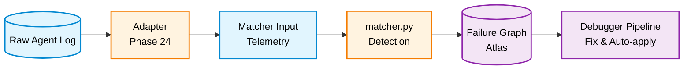
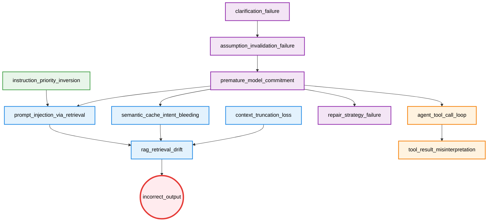

# LLM Failure Atlas

A graph-based failure modeling system for LLM agent runtimes.

Failures are nodes. Relationships between failures are edges. The system is defined as a causal graph.

---

## Related Repositories

| Repository | Role |
|---|---|
| [agent-failure-debugger](https://github.com/kiyoshisasano/agent-failure-debugger) | Consumes matcher output + this graph → causal diagnosis, fix generation, auto-apply |
| [agent-pld-metrics (PLD)](https://github.com/kiyoshisasano/agent-pld-metrics) | Behavioral stability framework this Atlas applies to |

---

## Purpose

The Atlas defines:

- **What failures exist** — 12 failure patterns across 5 layers
- **How they relate causally** — a directed graph with 12 edges
- **How to detect them** — signal-based pattern matching (22 signals)
- **How to adapt real logs** — adapters for LangChain / LangSmith traces
- **How to measure system health** — 6 operational KPIs

LLM systems fail in structured, repeatable ways. The Atlas makes those structures explicit and machine-readable.

---

## 1-Minute Demo

```bash
git clone https://github.com/kiyoshisasano/llm-failure-atlas.git
cd llm-failure-atlas
pip install -r requirements.txt

# Clone debugger as sibling (for full pipeline)
cd ..
git clone https://github.com/kiyoshisasano/agent-failure-debugger.git
cd agent-failure-debugger && pip install -r requirements.txt && cd ../llm-failure-atlas

# Run demo
python quickstart_demo.py
```

Output:

```
🚀 LLM Failure Atlas — Quickstart Demo

  Step 1: Load raw agent trace
  Source: sample_langchain_trace.json
  Query:  Change my flight to tomorrow morning
  Output: I've found several hotels near the airport for you.

  Step 2: Adapt trace → matcher input
  Cache hit:      True
  Intent match:   0.0
  Tool repeats:   2
  User corrected: True

  Step 3: Run matcher → detect failures
  ✅ incorrect_output    confidence=0.7
  Total diagnosed: 1 failures

  Step 4: Run debugger → diagnose root cause
  Root cause:  incorrect_output
  Gate:        proposal_only (score: 0.0)
```

The demo takes a raw LangChain trace, adapts it to matcher format, detects failures, and runs the full diagnosis pipeline.

---

## Adapters

Adapters convert raw agent logs into the telemetry format that the matcher expects.

```
[Your Agent]
  → LangSmith / LangChain trace
    → Adapter
      → matcher input (telemetry JSON)
        → matcher.py → diagnosed failures
          → debugger pipeline
```

### Available Adapters

| Adapter | Source | File |
|---|---|---|
| LangChain | LangChain trace JSON | `adapters/langchain_adapter.py` |
| LangSmith | LangSmith run-tree export | `adapters/langsmith_adapter.py` |

### Usage

```python
from adapters.langchain_adapter import LangChainAdapter
import json

with open("your_trace.json") as f:
    raw = json.load(f)

adapter = LangChainAdapter()
matcher_input = adapter.build_matcher_input(raw)
```

### Writing a Custom Adapter

Extend `BaseAdapter` and implement `normalize()` and `extract_features()`:

```python
from adapters.base_adapter import BaseAdapter

class MyAdapter(BaseAdapter):
    source = "my_platform"

    def normalize(self, raw_log: dict) -> dict:
        # Convert your log format to canonical structure
        ...

    def extract_features(self, normalized: dict) -> dict:
        # Extract matcher-compatible telemetry
        return {
            "input": {"ambiguity_score": ...},
            "interaction": {"clarification_triggered": ..., "user_correction_detected": ...},
            "reasoning": {"replanned": ...},
            "cache": {"hit": ..., "similarity": ..., "query_intent_similarity": ...},
            "retrieval": {"skipped": ...},
            "response": {"alignment_score": ...},
            "tools": {"call_count": ..., "repeat_count": ...},
        }
```

Signal extraction follows 3 tiers: deterministic (direct field mapping), computed (heuristic scoring), and LLM-assisted (optional, for ambiguous signals like `ambiguity_without_clarification`).

---

## Execution Pipeline



The Atlas provides the **structure, detection patterns, and adapters**. The [debugger](https://github.com/kiyoshisasano/agent-failure-debugger) provides interpretation, explanation, fix generation, and auto-apply.

---

## Core Idea

Failures are not independent. The same downstream failure (e.g. `rag_retrieval_drift`) can be caused by:

- Cache misuse (`semantic_cache_intent_bleeding`)
- Adversarial retrieval (`prompt_injection_via_retrieval`)
- Context window overflow (`context_truncation_loss`)

The Atlas makes these **competing causal paths explicit**.

---

## Causal Graph



Exclusivity constraint: `semantic_cache_intent_bleeding`, `prompt_injection_via_retrieval`, and `context_truncation_loss` cannot share the same root (soft exclusivity).

---

## Failure Definitions

| Failure | Layer | Description |
|---|---|---|
| `clarification_failure` | reasoning | Fails to request clarification under ambiguous input |
| `assumption_invalidation_failure` | reasoning | Persists with invalidated hypothesis despite contradicting evidence |
| `premature_model_commitment` | reasoning | Early fixation on a single interpretation |
| `repair_strategy_failure` | reasoning | Patches errors instead of regenerating from corrected assumptions |
| `semantic_cache_intent_bleeding` | retrieval | Cache reuse with intent mismatch |
| `prompt_injection_via_retrieval` | retrieval | Adversarial instructions in retrieved content |
| `context_truncation_loss` | retrieval | Critical information lost during context truncation |
| `rag_retrieval_drift` | retrieval | Degraded retrieval relevance due to upstream failure |
| `instruction_priority_inversion` | instruction | Lower-priority instructions override higher-priority ones |
| `agent_tool_call_loop` | tool | Repeated tool invocation without progress |
| `tool_result_misinterpretation` | tool | Misinterpretation of tool output |
| `incorrect_output` | output | Final output misaligned with user intent |

---

## Signal Contract

22 unique signals across 12 patterns. Signal names are system-wide contracts:

- A signal name must have exactly one definition across all patterns
- Do not redefine the same signal with a different rule
- If a different threshold is needed, define a new signal name

---

## Structure

```
llm-failure-atlas/
  failure_graph.yaml           # canonical causal graph (12 nodes, 12 edges)
  matcher.py                   # log → signals → diagnosed failures (reference)
  compute_kpi.py               # 6 operational KPIs
  quickstart_demo.py           # 1-minute end-to-end demo
  adapters/
    base_adapter.py            # abstract adapter interface
    langchain_adapter.py       # LangChain trace adapter
    langsmith_adapter.py       # LangSmith run-tree adapter
    sample_langchain_trace.json
    sample_langsmith_trace.json
    prompts/                   # Tier 3 LLM signal extraction prompts
  failures/                    # 12 failure pattern definitions (YAML)
  examples/                    # 10 example cases (log + matcher_output + expected)
  evaluation/                  # metrics.py + run_eval.py + 10 gold datasets
  validation/                  # 30 scenarios + 30 annotations + errors.json
  calibration/                 # run_calibration.py (SCIB grid search)
  learning/
    update_policy.py           # learning store update (suggestion-only)
    threshold_policy.json      # threshold adjustment proposals
    (runtime generated)        # fix_effectiveness.json, calibration_history.json,
                               # suggestions.json, run_history.json
```

---

## KPIs

`python compute_kpi.py` measures 6 operational indicators:

| KPI | Prevents | Target |
|---|---|---|
| threshold_boundary_rate | Detection instability | < 5% |
| fix_dominance | Fix overfitting | < 60% |
| failure_monotonicity | System runaway | > 90% |
| rollback_rate | Auto-apply safety risk | < 10% |
| no_regression_rate | Explicit degradation | > 95% |
| causal_consistency_rate | Policy drift | > 90% |

---

## Validation Results

30-scenario validation:

```
Root correctness:      92%
Path correctness:      84%
Explanation clarity:   82%
Errors: 2 (over_detection, legitimate edge cases)
```

---

## Design Principles

- **Graph-first** — failures are defined by their position in a causal structure
- **Signal uniqueness** — no duplicated signal definitions across patterns
- **Separation of concerns** — Atlas (structure + detection + adapters), debugger (interpretation + fix)
- **Learning is suggestion-only** — patterns, graph, and templates are never auto-modified
- **Adapters do not diagnose** — they only normalize and extract features

---

## Reproducible Examples

10 examples covering structural patterns:

| Example | Pattern |
|---|---|
| `simple` | Linear causal chain |
| `branching` | Diverging paths from common root |
| `competing` | Multiple upstream causes for same downstream |
| `multi_root` | Multiple independent root causes |
| `decompose` / `full_decompose` | Complex multi-layer cascades |
| `priority_inversion` | Instruction layer failure |
| `tool_chain` | Tool layer cascade |
| `three_way_conflict` | Three-way exclusivity conflict |
| `closed_graph` | Fully connected subgraph |

---

## Relationship to PLD

This Atlas is a concrete application of [Phase Loop Dynamics (PLD)](https://github.com/kiyoshisasano/agent-pld-metrics):

| PLD Phase | Atlas Equivalent |
|---|---|
| Drift | Initiating / upstream failure |
| Propagation | Downstream failure cascade |
| Repair | Fix generation (via debugger) |
| Outcome | System-level effect (`incorrect_output`) |

---

## License

MIT License. See [LICENSE](LICENSE).
