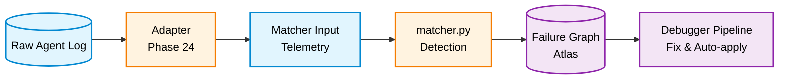
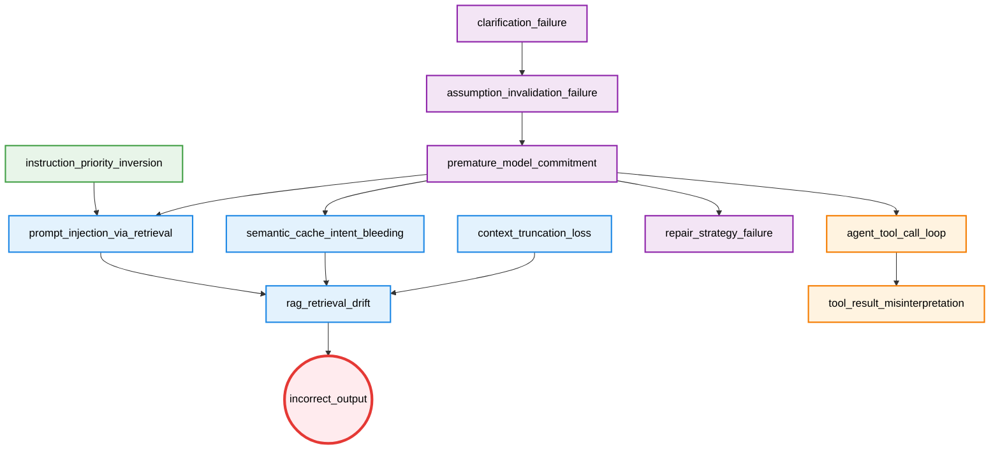

# LLM Failure Atlas

A graph-based failure modeling system for LLM agent runtimes.

Failures are nodes. Relationships between failures are edges. The system is defined as a causal graph.

---

## Related Repositories

| Repository | Role |
|---|---|
| [agent-failure-debugger](https://github.com/kiyoshisasano/agent-failure-debugger) | Consumes matcher output + this graph → causal diagnosis, fix generation, auto-apply |
| [agent-pld-metrics (PLD)](https://github.com/kiyoshisasano/agent-pld-metrics) | Behavioral stability framework this Atlas applies to |

---

## Purpose

The Atlas defines:

- **What failures exist** — 12 failure patterns across 5 layers
- **How they relate causally** — a directed graph with 12 edges
- **How to detect them** — signal-based pattern matching (22 signals)
- **How to adapt real logs** — adapters for LangChain / LangSmith traces
- **How to measure system health** — 6 operational KPIs

LLM systems fail in structured, repeatable ways. The Atlas makes those structures explicit and machine-readable.

---

## 1-Minute Demo

```bash
git clone https://github.com/kiyoshisasano/llm-failure-atlas.git
cd llm-failure-atlas
pip install -r requirements.txt

# Clone debugger as sibling (for full pipeline)
cd ..
git clone https://github.com/kiyoshisasano/agent-failure-debugger.git
cd agent-failure-debugger && pip install -r requirements.txt && cd ../llm-failure-atlas

# Run demo
python quickstart_demo.py
```

Output:

```
🚀 LLM Failure Atlas — Quickstart Demo

  Step 1: Load raw agent trace
  Source: sample_langchain_trace.json
  Query:  Change my flight to tomorrow morning
  Output: I've found several hotels near the airport for you.

  Step 2: Adapt trace → matcher input
  Cache hit:      True
  Intent match:   0.0
  Tool repeats:   2
  User corrected: True

  Step 3: Run matcher → detect failures
  ✅ incorrect_output    confidence=0.7
  Total diagnosed: 1 failures

  Step 4: Run debugger → diagnose root cause
  Root cause:  incorrect_output
  Gate:        proposal_only (score: 0.0)
```

The demo takes a raw LangChain trace, adapts it to matcher format, detects failures, and runs the full diagnosis pipeline.

---

## Adapters

Adapters convert raw agent logs into the telemetry format that the matcher expects.

```
[Your Agent]
  → LangSmith / LangChain trace
    → Adapter
      → matcher input (telemetry JSON)
        → matcher.py → diagnosed failures
          → debugger pipeline
```

### Available Adapters

| Adapter | Source | File |
|---|---|---|
| LangChain | LangChain trace JSON | `adapters/langchain_adapter.py` |
| LangSmith | LangSmith run-tree export | `adapters/langsmith_adapter.py` |

### Usage

```python
from adapters.langchain_adapter import LangChainAdapter
import json

with open("your_trace.json") as f:
    raw = json.load(f)

adapter = LangChainAdapter()
matcher_input = adapter.build_matcher_input(raw)
```

### Writing a Custom Adapter

Extend `BaseAdapter` and implement `normalize()` and `extract_features()`:

```python
from adapters.base_adapter import BaseAdapter

class MyAdapter(BaseAdapter):
    source = "my_platform"

    def normalize(self, raw_log: dict) -> dict:
        # Convert your log format to canonical structure
        ...

    def extract_features(self, normalized: dict) -> dict:
        # Extract matcher-compatible telemetry
        return {
            "input": {"ambiguity_score": ...},
            "interaction": {"clarification_triggered": ..., "user_correction_detected": ...},
            "reasoning": {"replanned": ...},
            "cache": {"hit": ..., "similarity": ..., "query_intent_similarity": ...},
            "retrieval": {"skipped": ...},
            "response": {"alignment_score": ...},
            "tools": {"call_count": ..., "repeat_count": ...},
        }
```

Signal extraction follows 3 tiers: deterministic (direct field mapping), computed (heuristic scoring), and LLM-assisted (optional, for ambiguous signals like `ambiguity_without_clarification`).

---

## Execution Pipeline



The Atlas provides the **structure, detection patterns, and adapters**. The [debugger](https://github.com/kiyoshisasano/agent-failure-debugger) provides interpretation, explanation, fix generation, and auto-apply.

---

## Core Idea

Failures are not independent. The same downstream failure (e.g. `rag_retrieval_drift`) can be caused by:

- Cache misuse (`semantic_cache_intent_bleeding`)
- Adversarial retrieval (`prompt_injection_via_retrieval`)
- Context window overflow (`context_truncation_loss`)

The Atlas makes these **competing causal paths explicit**.

---

## Causal Graph



Exclusivity constraint: `semantic_cache_intent_bleeding`, `prompt_injection_via_retrieval`, and `context_truncation_loss` cannot share the same root (soft exclusivity).

---

## Failure Definitions

| Failure | Layer | Description |
|---|---|---|
| `clarification_failure` | reasoning | Fails to request clarification under ambiguous input |
| `assumption_invalidation_failure` | reasoning | Persists with invalidated hypothesis despite contradicting evidence |
| `premature_model_commitment` | reasoning | Early fixation on a single interpretation |
| `repair_strategy_failure` | reasoning | Patches errors instead of regenerating from corrected assumptions |
| `semantic_cache_intent_bleeding` | retrieval | Cache reuse with intent mismatch |
| `prompt_injection_via_retrieval` | retrieval | Adversarial instructions in retrieved content |
| `context_truncation_loss` | retrieval | Critical information lost during context truncation |
| `rag_retrieval_drift` | retrieval | Degraded retrieval relevance due to upstream failure |
| `instruction_priority_inversion` | instruction | Lower-priority instructions override higher-priority ones |
| `agent_tool_call_loop` | tool | Repeated tool invocation without progress |
| `tool_result_misinterpretation` | tool | Misinterpretation of tool output |
| `incorrect_output` | output | Final output misaligned with user intent |

---

## Signal Contract

22 unique signals across 12 patterns. Signal names are system-wide contracts:

- A signal name must have exactly one definition across all patterns
- Do not redefine the same signal with a different rule
- If a different threshold is needed, define a new signal name

---

## Structure

```
llm-failure-atlas/
  failure_graph.yaml           # canonical causal graph (12 nodes, 12 edges)
  matcher.py                   # log → signals → diagnosed failures (reference)
  compute_kpi.py               # 6 operational KPIs
  quickstart_demo.py           # 1-minute end-to-end demo
  adapters/
    base_adapter.py            # abstract adapter interface
    langchain_adapter.py       # LangChain trace adapter
    langsmith_adapter.py       # LangSmith run-tree adapter
    sample_langchain_trace.json
    sample_langsmith_trace.json
    prompts/                   # Tier 3 LLM signal extraction prompts
  failures/                    # 12 failure pattern definitions (YAML)
  examples/                    # 10 example cases (log + matcher_output + expected)
  evaluation/                  # metrics.py + run_eval.py + 10 gold datasets
  validation/                  # 30 scenarios + 30 annotations + errors.json
  calibration/                 # run_calibration.py (SCIB grid search)
  learning/
    update_policy.py           # learning store update (suggestion-only)
    threshold_policy.json      # threshold adjustment proposals
    (runtime generated)        # fix_effectiveness.json, calibration_history.json,
                               # suggestions.json, run_history.json
```

---

## KPIs

`python compute_kpi.py` measures 6 operational indicators:

| KPI | Prevents | Target |
|---|---|---|
| threshold_boundary_rate | Detection instability | < 5% |
| fix_dominance | Fix overfitting | < 60% |
| failure_monotonicity | System runaway | > 90% |
| rollback_rate | Auto-apply safety risk | < 10% |
| no_regression_rate | Explicit degradation | > 95% |
| causal_consistency_rate | Policy drift | > 90% |

---

## Validation Results

30-scenario validation:

```
Root correctness:      92%
Path correctness:      84%
Explanation clarity:   82%
Errors: 2 (over_detection, legitimate edge cases)
```

---

## What This Is

This system is a **rule-based causal debugging framework** — not a machine learning model.

- **Deterministic:** Same input always produces the same diagnosis. No probabilistic inference, no distribution estimation, no neural components in the core pipeline.
- **Symbolic:** Each failure is defined as a deterministic scoring function over signals: confidence is computed as a weighted sum of signal activations, and diagnosis is triggered when the confidence exceeds a threshold. Causality is defined as a graph. Fixes are defined as templates. All are human-readable and auditable.
- **Consistent over correct:** The system guarantees a *consistent explanation* given the defined patterns and graph. It does not claim to find the "true" cause — it finds the best-supported cause within its formal structure.

What this means in practice:

- **Detection is local:** Each failure is diagnosed independently via its own scoring function. The causal graph does not influence detection.
- **Causality is structural, not statistical:** Edges represent designed relationships, not learned correlations.
- **Fixes are templates, not generated:** Autofix produces deterministic patches from a predefined map.
- **The system is extensible but not adaptive:** Adding new failure patterns requires no code changes, but the system does not discover new patterns on its own.

---

## Design Principles

- **Graph-first** — failures are defined by their position in a causal structure
- **Signal uniqueness** — no duplicated signal definitions across patterns
- **Separation of concerns** — Atlas (structure + detection + adapters), debugger (interpretation + fix)
- **Learning is suggestion-only** — patterns, graph, and templates are never auto-modified
- **Adapters do not diagnose** — they only normalize and extract features

---

## Reproducible Examples

10 examples covering structural patterns:

| Example | Pattern |
|---|---|
| `simple` | Linear causal chain |
| `branching` | Diverging paths from common root |
| `competing` | Multiple upstream causes for same downstream |
| `multi_root` | Multiple independent root causes |
| `decompose` / `full_decompose` | Complex multi-layer cascades |
| `priority_inversion` | Instruction layer failure |
| `tool_chain` | Tool layer cascade |
| `three_way_conflict` | Three-way exclusivity conflict |
| `closed_graph` | Fully connected subgraph |

---

## Relationship to PLD

This Atlas is a concrete application of [Phase Loop Dynamics (PLD)](https://github.com/kiyoshisasano/agent-pld-metrics):

| PLD Phase | Atlas Equivalent |
|---|---|
| Drift | Initiating / upstream failure |
| Propagation | Downstream failure cascade |
| Repair | Fix generation (via debugger) |
| Outcome | System-level effect (`incorrect_output`) |

---

## License

MIT License. See [LICENSE](LICENSE).

# agent-failure-debugger

A deterministic pipeline that diagnoses, explains, and fixes failures in LLM-based agent systems.

```
Detection tells you WHAT failed.
This tool tells you WHY — through which causal path, starting from which root.
And then fixes it.
```

---

## Related Repositories

| Repository | Role |
|---|---|
| [llm-failure-atlas](https://github.com/kiyoshisasano/llm-failure-atlas) | Failure pattern definitions, causal graph, matcher, evaluation, KPI |
| [agent-pld-metrics (PLD)](https://github.com/kiyoshisasano/agent-pld-metrics) | Behavioral stability framework this tool applies to |

---

## What It Does

**Input:** Matcher output (detected failures with confidence scores) + causal graph

**Output:**
- Root cause identification with causal ranking
- Full causal path reconstruction
- Deterministic fix generation with safety classification
- Confidence-gated auto-apply with rollback
- Learning-aware priority adjustment

---

## Quickstart

```bash
git clone https://github.com/kiyoshisasano/agent-failure-debugger.git
cd agent-failure-debugger
pip install -r requirements.txt
```

Run with sample data:

```bash
# Diagnosis only
python main.py ../llm-failure-atlas/examples/simple/matcher_output.json

# Full pipeline (recommended)
python pipeline.py ../llm-failure-atlas/examples/simple/matcher_output.json --use-learning
```

Output:

```
=== PIPELINE RESULT ===
  Root cause:  premature_model_commitment (confidence: 0.85)
  Failures:    3
  Fixes:       1
  Gate:        auto_apply (score: 0.9218)
  Applied:     no
```

---

## Use as an API

```python
from pipeline import run_pipeline
import json

with open("matcher_output.json") as f:
    matcher_output = json.load(f)

result = run_pipeline(
    matcher_output,
    use_learning=True,   # adjust priority using learning data
    top_k=1,             # number of fixes to generate
    auto_apply=False,    # set True to auto-apply safe fixes
)

print(result["summary"]["root_cause"])   # "premature_model_commitment"
print(result["summary"]["gate_mode"])    # "auto_apply"
```

Individual steps are also available:

```python
from pipeline import run_diagnosis, run_fix

diag = run_diagnosis(matcher_output)
fix_result = run_fix(diag, use_learning=True, top_k=2)
```

### External Evaluation (Phase 25-lite)

You can plug in your own test environment for fix evaluation:

```python
def my_staging_test(bundle):
    """Run fixes in your staging environment."""
    fixes = bundle["autofix"]["recommended_fixes"]
    # ... apply fixes in your own test/staging env ...
    return {
        "success": True,
        "failure_count": 0,
        "root": None,
        "has_hard_regression": False,
        "notes": f"applied {len(fixes)} fixes in staging"
    }

result = run_pipeline(
    matcher_output,
    use_learning=True,
    auto_apply=True,
    evaluation_runner=my_staging_test,
)
```

If `evaluation_runner` is not provided, the built-in counterfactual simulation is used. If provided and the gate passes, your function is called instead.

---

## Pipeline


Debugger internal steps:

```
matcher_output.json   (produced by llm-failure-atlas matcher)
  → main.py             causal resolution + root ranking
  → abstraction.py      top-k path selection + clustering
  → explainer.py        deterministic draft + optional LLM smoothing
  → decision_support.py priority scoring + action plan
  → autofix.py          fix selection + patch generation
  → auto_apply.py       confidence gate → apply / review / proposal
  → execute_fix.py      dependency ordering + staged apply
  → evaluate_fix.py     before/after simulation + regression detection
```

---

## Prerequisite: Matcher

This tool expects matcher output as input. The matcher converts logs into detected failures:

```
log → signals → failure detection (matcher)
```

Pattern definitions are maintained in [llm-failure-atlas](https://github.com/kiyoshisasano/llm-failure-atlas) under `failures/*.yaml`. Pre-generated `matcher_output.json` files are available in each `examples/` directory for immediate use.

---

## Input Format

Matcher output: a JSON array of failure results. Each entry must include `failure_id`, `diagnosed`, and `confidence`.

```json
[
  {
    "failure_id": "premature_model_commitment",
    "diagnosed": true,
    "confidence": 0.7,
    "signals": {
      "ambiguity_without_clarification": true,
      "assumption_persistence_after_correction": true
    }
  }
]
```

Failures with `"diagnosed": false` are silently excluded.

---

## Output Format

```json
{
  "root_candidates": ["premature_model_commitment"],
  "root_ranking": [{"id": "premature_model_commitment", "score": 0.85}],
  "failures": [
    {"id": "premature_model_commitment", "confidence": 0.7},
    {"id": "semantic_cache_intent_bleeding", "confidence": 0.7,
     "caused_by": ["premature_model_commitment"]},
    {"id": "rag_retrieval_drift", "confidence": 0.6,
     "caused_by": ["semantic_cache_intent_bleeding"]}
  ],
  "causal_paths": [
    ["premature_model_commitment", "semantic_cache_intent_bleeding", "rag_retrieval_drift"]
  ],
  "explanation": "..."
}
```

---

## Root Ranking

```
score = 0.5 × confidence + 0.3 × normalized_downstream + 0.2 × (1 - normalized_depth)
```

A failure with more downstream impact ranks higher, even if its confidence is lower. This reflects causal priority, not detection confidence alone.

---

## Auto-Apply Gate

Fix application is controlled by a deterministic confidence gate:

| Score | Mode | Behavior |
|---|---|---|
| ≥ 0.85 | `auto_apply` | Apply → evaluate → keep or rollback |
| 0.65–0.85 | `staged_review` | Write to patches/, await human approval |
| < 0.65 | `proposal_only` | Present fix proposal only |

Hard blockers (override score, force proposal_only):
- `safety != "high"`
- `review_required == true`
- `fix_type == "workflow_patch"`
- Execution plan has conflicts or failed validation

---

## File Structure

**Core pipeline:**

| File | Responsibility |
|---|---|
| `pipeline.py` | API entry point (recommended) |
| `main.py` | CLI entry point (diagnosis only) |
| `config.py` | Centralized paths, weights, thresholds |
| `graph_loader.py` | Load failure_graph.yaml, exclude planned nodes |
| `causal_resolver.py` | normalize → roots → paths → ranking |
| `formatter.py` | Path scoring + conflict resolution + evidence |
| `labels.py` | SIGNAL_MAP (22 entries) + FAILURE_MAP (12 entries) |
| `abstraction.py` | Top-k path selection + clustering |
| `explainer.py` | Deterministic draft + optional LLM smoothing |
| `decision_support.py` | Failure → action mapping + priority scoring |
| `autofix.py` | Fix selection + patch generation |
| `fix_templates.py` | 12 failure × fix definitions |
| `execute_fix.py` | Dependency ordering + staged apply + rollback |
| `evaluate_fix.py` | Counterfactual simulation + regression detection |
| `auto_apply.py` | Confidence gate + auto-apply + rollback |
| `policy_loader.py` | Read-only access to learning stores |

**CLI wrappers:**

| File | Wraps |
|---|---|
| `explain.py` | `explainer.py` |
| `summarize.py` | `abstraction.py` |
| `advise.py` | `decision_support.py` |
| `apply_fix.py` | `execute_fix.py` (dry-run display) |

**Data:**

| File | Note |
|---|---|
| `failure_graph.yaml` | Causal graph (canonical source is Atlas; see below) |
| `templates/` | Prompt templates for LLM-based explanation |

---

## Graph Sync

`failure_graph.yaml` exists in both repositories. The **canonical source** is always `llm-failure-atlas/failure_graph.yaml`. The copy in this repository must be kept in sync manually.

To verify sync:

```bash
diff failure_graph.yaml ../llm-failure-atlas/failure_graph.yaml
```

If you set `ATLAS_ROOT`, `config.py` can resolve the Atlas graph path directly.

---

## Configuration

Environment variables override defaults:

| Variable | Default | Description |
|---|---|---|
| `ATLAS_ROOT` | `../llm-failure-atlas` | Path to Atlas repository |
| `DEBUGGER_ROOT` | `.` (this repository) | Path to this repository |
| `ATLAS_LEARNING_DIR` | `$ATLAS_ROOT/learning` | Learning store location |

All settings (scoring weights, gate thresholds, KPI targets) are centralized in `config.py`.

---

## What This Is

This tool is a **deterministic causal debugging pipeline** — not an ML-based anomaly detector.

- **Deterministic:** Same matcher output always produces the same root cause, causal path, fix, and gate decision. The core pipeline uses no LLM inference (LLM is optional, for explanation smoothing only).
- **Causal, not statistical:** Root ranking uses graph structure and confidence scores, not learned weights or embeddings.
- **Consistent over correct:** The system guarantees a *consistent explanation* within its formal structure. It finds the best-supported root cause given the defined causal graph — not necessarily the "true" cause.

Key implications:

- Root cause ranking is reproducible and auditable
- Auto-apply decisions are governed by a deterministic confidence gate, not LLM judgment
- The evaluate_fix stage applies a structural intervention model: targeted failures and all their downstream descendants are removed from the causal graph, and the system state is recomputed
- Learning adjusts *weights*, never *structure* (patterns, graph, and templates are never auto-modified)

---

## Design Principles

- **Graph is not used for diagnosis** — only for causal interpretation
- **Signal names are system-wide contracts** — no redefinition allowed
- **Adding a failure to the Atlas requires no changes to this tool**
- **Learning is suggestion-only** — patterns, graph, and templates are never auto-modified
- **Auto-apply safety hierarchy:** high → auto candidate, medium → review, low → excluded

---

## Relationship to Atlas

This tool depends on [LLM Failure Atlas](https://github.com/kiyoshisasano/llm-failure-atlas):

- `failure_graph.yaml` is sourced from the Atlas
- Node and edge definitions are maintained there
- This tool does not define failures itself

---

## Relationship to PLD

This tool is a concrete application of [Phase Loop Dynamics (PLD)](https://github.com/kiyoshisasano/agent-pld-metrics):

| PLD Phase | Debugger Output |
|---|---|
| Drift | Initiating failure in `root_candidates` |
| Propagation | Downstream failures in `causal_paths` |
| Repair | Fix generation + auto-apply gate |
| Outcome | Leaf node / evaluation decision (keep/rollback) |

PLD provides the behavioral stability framework. This tool provides the causal diagnosis and remediation layer that operates within it.

---

## Reproducible Examples

10 examples are maintained in [llm-failure-atlas](https://github.com/kiyoshisasano/llm-failure-atlas) under `examples/`. Each contains `log.json`, `matcher_output.json`, and `expected_debugger_output.json`.

Run and compare:

```bash
python main.py ../llm-failure-atlas/examples/simple/matcher_output.json
```

Output should match `expected_debugger_output.json` exactly.

---

## License

MIT License. See [LICENSE](LICENSE).
