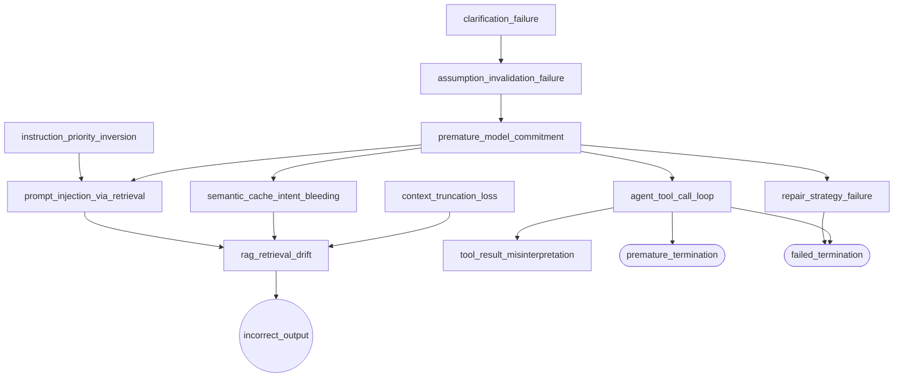

# LLM Failure Atlas

[](https://pypi.org/project/llm-failure-atlas/)
[](https://pypi.org/project/llm-failure-atlas/)

The detection and pattern library for LLM agent failures. Defines failure patterns, signals, and adapters. Fully deterministic, no ML required.

```bash
pip install llm-failure-atlas
```

**Atlas detects.** For root cause diagnosis, explanation, and fixes, use [agent-failure-debugger](https://pypi.org/project/agent-failure-debugger/).

| When | Use | What you get |
|---|---|---|
| Agent is running (detection only) | `watch(graph, auto_diagnose=True)` | Detected failures (pattern matching + signals) |
| Agent is running (full pipeline) | `watch(graph, auto_pipeline=True)` | Detection + diagnosis + fix proposal during execution |
| You have a log file | Debugger `diagnose()` | Root cause + explanation + fix proposal from saved logs |

```python
# Detection only (Atlas)
from llm_failure_atlas.adapters.callback_handler import watch
graph = watch(workflow.compile(), auto_diagnose=True)

# Full diagnosis (via Debugger)
from agent_failure_debugger import diagnose
result = diagnose(raw_log, adapter="langchain")
```

---

## End-to-End Example (Atlas + Debugger)

Run a full example including detection (Atlas) and diagnosis (Debugger):

```bash
pip install llm-failure-atlas

# For full pipeline (detection + diagnosis + fixes):
pip install agent-failure-debugger
```

---

## How to Use

Add one line to your LangGraph agent for failure detection:

```python
from llm_failure_atlas.adapters.callback_handler import watch

graph = watch(workflow.compile(), auto_diagnose=True)
result = graph.invoke({"messages": [HumanMessage(content="...")]})
# → detected failures printed on completion
```

**Flags:**
- `auto_diagnose=True` — run Atlas detection only (pattern matching + signals, no causal analysis)
- `auto_pipeline=True` — also run the [debugger](https://github.com/kiyoshisasano/agent-failure-debugger) pipeline (root cause, explanation, fix proposal) automatically

The original graph behavior is unchanged. Requires `pip install langchain-core`. Core pipeline requires only `pyyaml`.

**Other integration options:**

Adapters normalize raw logs from different frameworks into the format Atlas expects.

| Method | Use when | Code |
|---|---|---|
| Callback handler | Any LangChain/LangGraph agent | `config={"callbacks": [AtlasCallbackHandler(auto_diagnose=True)]}` |
| CrewAI listener | CrewAI crews | `AtlasCrewListener(auto_diagnose=True)` — auto-registers on event bus |
| Batch adapter | Post-hoc analysis from JSON exports | `LangChainAdapter().build_matcher_input(raw_trace)` |
| Redis help demo | [Redis workshop](https://github.com/bhavana-giri/movie-recommender-rag-semantic-cache-workshop) /api/help/chat | `RedisHelpDemoAdapter().build_matcher_input(response)` |

See `src/llm_failure_atlas/adapters/` for full examples of each method.

**Status:** Atlas is an experimental detection layer, not a production monitoring system. It is designed for diagnostic support, not automated enforcement.

**When to use Atlas:**

- Every agent run — get execution quality status (healthy/degraded/failed) alongside detection results
- Development and debugging — understanding why an agent failed
- Regression testing — detecting recurring failure patterns
- CI/CD pipelines — automated health checks on agent behavior

Atlas is not designed for real-time production blocking or high-stakes automated decisions without human review.

**Integration requirements:** Atlas requires access to tool call logs (name, count, result), agent responses, and basic interaction metadata. If your framework does not expose these, a custom adapter is needed. Without tool-level telemetry, some patterns will not fire (see Known Limitations).

**Typical workflow:** Run your agent with Atlas enabled → check execution quality status → investigate root cause if degraded or failed → apply fixes manually or via the debugger → re-run and compare.

---

## What You Get

When a failure is detected:

```
Root cause:  agent_tool_call_loop (conf=0.55)
Failures:    1
Gate:        proposal_only (score=0.0)

Explanation:
  Context: Root cause identified: the agent repeatedly invoked tools
           without making meaningful state progress.
  Risk: MEDIUM
  Action: Review the proposed fix before applying.
```

When no failure is detected but signals indicate a potential risk:

```
Failures:   none detected
Grounding:  tool_provided_data=False  uncertainty_acknowledged=True
```

**How to interpret confidence scores:**

Confidence reflects rule-based evidence accumulation, not statistical probability. Each signal adds a fixed amount; scores are not calibrated against labeled data.

| Range | Meaning | Suggested action |
|---|---|---|
| < 0.5 | Weak signal, partial evidence only | Informational, no action needed |
| 0.5–0.7 | Moderate evidence from multiple signals | Review the trace to confirm |
| > 0.7 | Strong pattern match, multiple signals agree | Likely actionable, apply suggested fix |

This specific combination (no data + disclosed) is acceptable behavior. Other grounding states — such as no data without disclosure, or thin grounding with high expansion ratio — may indicate risk. See the [Operational Playbook](docs/operational_playbook.md) for the full decision framework.

For real-world walkthroughs, see [Applied Debugging Examples](docs/applied_debugging_examples.md).

---

## Minimal Detection Example (Matcher Only)

Run a single failure pattern against a prepared matcher input — no agent, no debugger:

```python
from llm_failure_atlas.matcher import run
from llm_failure_atlas.resource_loader import get_patterns_dir
from pathlib import Path

# Run a single pattern
patterns = Path(get_patterns_dir())
result = run(str(patterns / "incorrect_output.yaml"), "examples/sample_matcher_input.json")

print(result["failure_id"])   # "incorrect_output"
print(result["diagnosed"])    # True
print(result["confidence"])   # 0.7
print(result["signals"])      # which signals fired
```

This is useful for understanding how detection works, testing custom adapters, or debugging signal behavior. For full pipeline usage (diagnosis, explanation, fixes), use [agent-failure-debugger](https://github.com/kiyoshisasano/agent-failure-debugger).

---

## What It Detects

17 failure patterns (14 domain + 3 meta) across 5 layers, connected by a causal graph (17 nodes, 15 edges).

**Domain failures:**

| Failure | Layer | Description |
|---|---|---|
| `clarification_failure` | reasoning | Fails to request clarification under ambiguous input |
| `assumption_invalidation_failure` | reasoning | Persists with invalidated hypothesis |
| `premature_model_commitment` | reasoning | Early fixation on a single interpretation |
| `repair_strategy_failure` | reasoning | Patches errors instead of regenerating |
| `semantic_cache_intent_bleeding` | retrieval | Cache reuse with intent mismatch |
| `prompt_injection_via_retrieval` | retrieval | Adversarial instructions in retrieved content |
| `context_truncation_loss` | retrieval | Critical information lost during truncation |
| `rag_retrieval_drift` | retrieval | Degraded retrieval relevance |
| `instruction_priority_inversion` | instruction | Lower-priority instructions override higher |
| `agent_tool_call_loop` | tool | Repeated tool invocation without progress |
| `tool_result_misinterpretation` | tool | Misinterpretation of tool output |
| `incorrect_output` | output | Final output misaligned with user intent |
| `premature_termination` | output | Agent exited without producing output or error |
| `failed_termination` | output | Agent exited due to execution error |

**Meta failures** (model limitation indicators, not part of causal graph):

| Failure | Fires when |
|---|---|
| `unmodeled_failure` | Symptoms present but no domain pattern matched |
| `insufficient_observability` | Too many expected telemetry fields missing |
| `conflicting_signals` | Signals point in contradictory directions |

---

## Causal Graph

You don't need to memorize this graph. The tool traverses it for you and reports the root cause automatically.



The same downstream failure can have multiple upstream causes. The graph makes competing causal paths explicit.

---

## Observation Layer

The callback handler infers telemetry fields not directly observable from agent events.

| Field | Inference method |
|---|---|
| `input.ambiguity_score` | Word count + pronoun/vague term detection |
| `interaction.user_correction_detected` | Response admits failure + pivots to different topic |
| `response.alignment_score` | Word overlap - topic mismatch penalty - negation penalty |
| `state.progress_made` | Any tool returned non-error output |
| `state.any_tool_looping` | Any tool called 3+ times with zero successes (per-tool evaluation) |
| `tools.soft_error_count` | Tool output text contains error/empty markers |
| `tools.error_count` | Tool-level exceptions (HTTP errors, timeouts, MCP failures) |
| `tools.hard_error_detected` | True if any tool raised an exception (vs returning empty) |
| `grounding.tool_provided_data` | At least one tool returned non-error output |
| `grounding.uncertainty_acknowledged` | Response contains staleness/uncertainty language |
| `grounding.source_data_length` | Total character count of usable tool outputs |
| `grounding.expansion_ratio` | response_length / source_data_length |
| `grounding.tool_result_diversity` | Unique tool outputs / total tool calls (low value = redundant calls) |
| `retrieval.adversarial_score` | Keyword scan of retrieved documents for injection patterns |
| `context.truncated` | Input tokens exceed 85% of model context window |

34 signals across 17 patterns. Each signal tracks observation quality: unobserved signals receive 0.6x confidence decay.

---

## Tested with Real Agents

Verified with real LangGraph agents under controlled scenarios, using OpenAI, Anthropic, and Google APIs.

| Scenario | gpt-4o-mini | Claude Haiku 4.5 | Gemini 2.5 Flash |
|---|---|---|---|
| Forced topic pivot | `incorrect_output` (0.7) | `incorrect_output` (0.7) | `incorrect_output` (0.7) |
| Forced tool retry loop | `agent_tool_call_loop` (0.7) | `agent_tool_call_loop` (0.7) | `agent_tool_call_loop` (0.7) |
| No clarification allowed | `clarification_failure` (0.7) | `clarification_failure` (0.7) | `clarification_failure` (0.7) |

Scenarios use system prompts to induce specific failure behaviors, ensuring reproducibility across model versions. Without constraints, the three models handle the same inputs differently: Claude asks for clarification where gpt-4o-mini guesses, Gemini asks for dates where Claude asks for IDs. Atlas correctly reports 0 failures when no failure occurs, regardless of model.

Both `watch()` and `diagnose()` code paths produce identical telemetry and diagnoses. See [Cross-Model Validation](docs/cross_model_validation.md) for the full report.

**Adapter verification status:**

| Adapter | Verified | Notes |
|---|---|---|
| callback_handler (watch) | ✅ 3 models | gpt-4o-mini, Claude Haiku, Gemini 2.5 Flash |
| langchain_adapter | ✅ Parity confirmed | Identical telemetry and detection to watch() |
| langsmith_adapter | ✅ Parity confirmed | Identical telemetry and detection to langchain_adapter |
| crewai_adapter | ⚠ Stage 1 verified | Functional but does not yet produce `state` or `grounding` telemetry. Core detection (tool calls, alignment, clarification) works; `agent_tool_call_loop` may not fire when using `diagnose()` (batch adapter path) |
| redis_help_demo_adapter | ⚠ Stage 1 verified | Tested with Redis workshop; not re-verified after Phase 2 marker changes |

Additional: 10/10 regression tests, 7/7 false positive tests (0 domain failures on healthy telemetry), 5 derailment tests (5/5 PASS), 25 observation logic checks (25/25 PASS).

**Redis Semantic Cache experiment:**

Tested with a Redis RAG + Semantic Cache demo (30 seed/probe pairs across 3 rounds, 15 cache hits observed). Cache reuse with different-intent queries occurred frequently. Similarity values for different-query and valid-rephrase cases overlapped, confirming that a single similarity threshold cannot reliably separate the two. The current `semantic_cache_intent_bleeding` signal did not trigger for any observed case. Detection improvement requires a secondary signal beyond similarity. See [SCIB Observation Results](docs/deep_analysis/scib_observation_results.md) for details.

---

## Writing a Custom Adapter

Extend `BaseAdapter`:

```python
from llm_failure_atlas.adapters.base_adapter import BaseAdapter

class MyAdapter(BaseAdapter):
    source = "my_platform"

    def normalize(self, raw_log: dict) -> dict: ...

    def extract_features(self, normalized: dict) -> dict:
        return {
            "input": {"ambiguity_score": ...},
            "interaction": {"clarification_triggered": ..., "user_correction_detected": ...},
            "reasoning": {"replanned": ..., "hypothesis_count": ...},
            "cache": {"hit": ..., "similarity": ..., "query_intent_similarity": ...},
            "retrieval": {"skipped": ...},
            "response": {"alignment_score": ...},
            "tools": {"call_count": ..., "repeat_count": ..., "soft_error_count": ...},
            "state": {"progress_made": ..., "any_tool_looping": ...},
            "grounding": {"tool_provided_data": ..., "uncertainty_acknowledged": ...,
                          "response_length": ..., "source_data_length": ...,
                          "expansion_ratio": ...},
        }
```

---

## Pipeline

```
[Your Agent] → Adapter → Telemetry → Matcher → Debugger → Fix + Explanation
```

The Atlas provides structure, detection, and adapters. The [debugger](https://github.com/kiyoshisasano/agent-failure-debugger) provides causal interpretation, explanation, fix generation, and auto-apply.

---

## KPIs

| KPI | Prevents | Target |
|---|---|---|
| threshold_boundary_rate | Detection instability | < 5% |
| fix_dominance | Fix overfitting | < 60% |
| failure_monotonicity | System runaway | > 90% |
| rollback_rate | Auto-apply safety risk | < 10% |
| no_regression_rate | Explicit degradation | > 95% |
| causal_consistency_rate | Policy drift | > 90% |

---

## Design Principles

- **Deterministic** — same input, same diagnosis. No probabilistic inference.
- **Symbolic** — all rules are human-readable. No learned models in the core.
- **Consistent over correct** — best-supported cause, not necessarily the "true" cause.
- **Detection is local** — each failure is scored independently. The graph is for interpretation only.
- **Signal uniqueness** — one definition per signal across all patterns.
- **Learning is suggestion-only** — patterns, graph, and templates are never auto-modified.
- **Observation quality** — unobserved signals receive 0.6x confidence decay.

---

## Full Pipeline Example (Atlas + Debugger)

```python
from agent_failure_debugger import diagnose

raw_log = {
    "inputs": {"query": "Change my flight to tomorrow morning"},
    "outputs": {"response": "I've found several hotels near the airport for you."},
    "steps": [
        {"type": "llm", "outputs": {"text": "Let me check available flights."}},
        {"type": "tool", "name": "search_flights", "inputs": {"date": "2025-03-20"},
         "outputs": {"flights": []}, "error": None},
        {"type": "tool", "name": "search_flights", "inputs": {"date": "2025-03-20"},
         "outputs": {"flights": []}, "error": None},
        {"type": "tool", "name": "search_flights", "inputs": {"date": "2025-03-20"},
         "outputs": {"flights": []}, "error": None},
        {"type": "llm", "outputs": {"text": "I've found several hotels near the airport."}}
    ],
    "feedback": {"user_correction": "I asked about flights, not hotels."}
}

result = diagnose(raw_log, adapter="langchain")
print(result["summary"]["root_cause"])
```

Requires `pip install agent-failure-debugger`. See [Quick Start Guide](docs/quickstart.md) for more usage patterns.

## Common Mistakes

| Problem | Cause | Fix |
|---|---|---|
| "0 failures detected" | Adapter got insufficient data | Provide complete trace with tool calls |
| Wrong results | Input format doesn't match adapter | See [Adapter Formats](docs/adapter_formats.md) |
| Pattern doesn't fire | Adapter doesn't produce required fields | Check [Adapter Coverage](docs/limitations_faq.md#adapter-coverage) |

**⚠ No error is raised for wrong inputs.** The system silently returns zero failures if the adapter cannot extract signals.

## This Tool Cannot

- Verify factual correctness of agent responses
- Detect semantic mismatch (requires embeddings)
- Analyze multi-agent system coordination

These reflect the current scope of deterministic, heuristic-based detection — not permanent design limits. The architecture (adapter → signal → matcher → graph) is designed to accommodate new signal sources, including embedding-based or ML-assisted layers, without changing the core pipeline.

See [Limitations & FAQ](docs/limitations_faq.md) for details.

---

## Known Limitations

Some failure-like behaviors are observable but not yet diagnosable as failure patterns. Each has specific conditions for promotion — they are not permanently excluded but require additional data, signals, or calibration:

- **Thin grounding** — the agent produces detailed specifics without source data, sometimes while acknowledging the lack of data. Observed across gpt-4o-mini and Claude Haiku in 3 domains (weather, stock, restaurant). A draft pattern has been validated (5 cases detected, 0 false positives) but is not yet part of the detection set. Threshold calibration for mid-range responses is still needed before promotion.
- **Cache intent mismatch** — a semantically similar but different-intent query receives a cached response. Tested with 30 seed/probe pairs; similarity ranges for valid and invalid reuse overlap, confirming that similarity alone is insufficient. Requires a secondary signal.
- **Semantic mismatch** — a tool returns data for a completely different topic. Not detectable with current heuristics; requires embedding-based comparison (Layer 1 ML).

These are tracked as observation gaps, not planned features. See [Failure Eligibility](docs/deep_analysis/failure_eligibility.md) for the conditions required to promote each to a diagnosable pattern.

**Heuristic limitations:**

- **Soft error detection** — tool output is scanned for keywords ("error", "not found", "empty", etc.) to infer whether the tool returned usable data. Normal output that incidentally contains these words in a different context may be misclassified. If this causes false positives for your domain, review `TOOL_SOFT_ERROR_MARKERS` in the adapter you are using.
- **Model context limits** — context truncation risk is estimated using hardcoded token limits per model (`MODEL_CONTEXT_LIMITS` in `callback_handler.py`). New models require a manual update to this dictionary. If a model is not listed, truncation detection is skipped rather than guessed.
- **Adapter-dependent patterns** — some patterns (e.g., `tool_result_misinterpretation`) require telemetry fields (`tool.output_valid`, `state.updated_correctly`) that no adapter currently produces. These patterns exist in the taxonomy but will not fire until an adapter emits the required fields.

**Design boundary — state telemetry:**

The `state` section in telemetry contains local aggregations (per-tool call counts, success/failure counts) and their direct derivations (`any_tool_looping`, `progress_made`). It does not contain cross-pattern logic, causal inference, or multi-step reasoning. These belong in the matcher and debugger pipeline, not in the adapter.

---

## Design Positioning

This project differs from other approaches to LLM agent reliability:

| Approach | How it works | Tradeoff |
|---|---|---|
| LLM-as-a-judge | LLM evaluates agent output | Probabilistic, non-deterministic, expensive |
| Observability platforms | Collect and display traces | Data collection, not diagnosis |
| Runtime verification | Monitor against formal specifications | Requires formal specs per agent |
| Guardrails / validators | Block or filter inputs/outputs | Prevention, not diagnosis |
| **This project** | **Deterministic signal extraction + causal graph** | **Explainable but heuristic-bound** |

Atlas occupies a specific position: a deterministic diagnosis layer that produces the same result for the same input, explains why it reached that conclusion, and does not require ML or formal specifications. This makes it auditable and reproducible, at the cost of being limited to what keyword/threshold heuristics can observe. This deterministic core is intended as a stable foundation — additional signal layers (embedding-based, ML-assisted) can be introduced as optional advisory inputs without breaking reproducibility.

## Telemetry Model

This project does not define a universal telemetry standard. Instead, it consumes framework-specific telemetry via adapters and maps it into a deterministic signal space.

| System | Approach |
|---|---|
| OpenTelemetry GenAI | Standardized trace schema for LLM calls |
| OpenInference | Unified observability attributes for AI |
| This project | Signal extraction layer on top of arbitrary telemetry |

This allows portability without requiring instrumentation changes. If a future standardized tracing format emerges, a new adapter can map it into Atlas's signal space without changing the matcher or patterns.

## Telemetry Limitations

Atlas does not operate on full event sequences. Telemetry is a summarized state representation (aggregated counters and inferred fields), not an ordered execution trace. This means:

- Temporal patterns are approximated via aggregated signals (e.g., per-tool repeat counts with success/failure tracking)
- Exact step-by-step reasoning or ordering is not reconstructed
- Some trajectory-level failures (e.g., premature stopping after partial progress) are not addressed by the current telemetry model

This is a design tradeoff for determinism and simplicity in the current implementation.

## Scope of Failures

Atlas focuses on single-agent runtime failures:

- Reasoning failures (clarification, commitment, assumption persistence)
- Tool interaction failures (loops, misinterpretation)
- Retrieval and cache failures (drift, injection, truncation)
- Output failures (misalignment, incorrect result)
- Termination failures (silent exit, error-driven exit). These describe how execution ended, not necessarily the root cause

The same patterns also apply to non-LLM systems with similar step/retry/termination structures. See [examples/workflow_pipeline](examples/workflow_pipeline/) (order processing pipeline) and [examples/api_orchestration](examples/api_orchestration/) (multi-API service) for demonstrations with no LLM involved.

It does not currently cover:

- Multi-agent coordination failures (see [MAST](https://github.com/multi-agent-systems-failure-taxonomy/MAST))
- Semantic correctness beyond keyword heuristics (requires embedding/ML)
- Infrastructure failures outside the agent runtime (network, deployment)

The pattern set and causal graph are versioned and extensible. New patterns can be added by defining a YAML file and connecting it to the graph; new signal sources can be introduced via adapters without modifying the matcher or existing patterns.

## Evaluation Status

Atlas uses multiple evaluation methods across different layers:

**Evaluation dataset (evaluation/):** 10 cases with ground truth (expected root cause, expected causal path, expected conflicts). `metrics.py` computes detection precision/recall/F1, root accuracy, root MRR, path exact/partial match, conflict accuracy, and explanation faithfulness/signal coverage/causal order. Run `python evaluation/run_eval.py` to reproduce.

**Validation set (validation/):** 30 scenarios across 9 categories (adversarial, ambiguous, clean, false positive, missing fields, multi-cause, partial signal, regression, tool failure) with 30 human annotations (root_score, path_score, explanation_score on a 0–2 scale). `run_real_eval.py` runs matcher → debugger → explainer, performs automatic weak signal checks and error classification (false_positive, false_negative, wrong_root, over_detection, threshold_boundary), and cross-references against human judgment.

**Regression and false positive testing:** 10/10 regression PASS, 7/7 false positive PASS (healthy telemetry produces 0 domain failures), 9/9 cross-model PASS.

**Mutation testing:** Healthy telemetry is mutated to inject each failure pattern. 13/14 domain patterns are testable (tool_result_misinterpretation requires adapter fields no adapter currently produces). Mutation score: 13/13 KILLED (100% of testable patterns detected when injected). Run `python evaluation/mutation_eval.py` to reproduce.

**Sensitivity analysis:** Numeric thresholds are swept to identify transition points where detection flips. All patterns show clean transitions at documented thresholds with no unstable regions. Run `python evaluation/sensitivity_eval.py` to reproduce.

**Cross-model validation:** Tested with real APIs (gpt-4o-mini, Claude Haiku 4.5, Gemini 2.5 Flash) under controlled LangGraph scenarios. Both `watch()` and `diagnose()` code paths produce identical telemetry and diagnoses. See [Cross-Model Validation](docs/cross_model_validation.md).

**What is not yet evaluated:**

- Quantitative detection accuracy (precision/recall) against external agent benchmarks. Candidate datasets exist — BFCL (tool-calling correctness), ToolBench (API usage trajectories), WebArena (web task traces), SWE-bench (code editing traces), GAIA (multi-step QA) — but adapting their traces and success/failure labels to Atlas's failure pattern taxonomy has not yet been done. Taxonomy-level comparison has been completed against MAST (multi-agent, NeurIPS 2025) and Rosen's Cogency Framework (specification quality)
- Real-world production validation depends on developer feedback (traces welcome)

Atlas patterns have been mapped to [MAST](https://github.com/multi-agent-systems-failure-taxonomy/MAST) for taxonomy comparison (see [MAST mapping analysis](docs/deep_analysis/mast_mapping_analysis.md)).

---

## Structure

```
llm-failure-atlas/
  pyproject.toml                         # PyPI package config
  src/llm_failure_atlas/
    __init__.py                          # package entry, version
    matcher.py                           # detection engine
    resource_loader.py                   # resolve bundled resources
    compute_kpi.py                       # 6 operational KPIs
    adapters/
      callback_handler.py               # real-time callback + watch()
      crewai_adapter.py                  # CrewAI event listener
      langchain_adapter.py              # LangChain batch adapter
      langsmith_adapter.py              # LangSmith batch adapter
      redis_help_demo_adapter.py        # Redis workshop adapter
      base_adapter.py                   # abstract interface
    resources/
      failures/                         # 17 pattern definitions (YAML)
      graph/failure_graph.yaml          # causal graph (17 nodes, 15 edges)
      learning/                         # default learning stores
    learning/
      update_policy.py                  # suggestion-only learning
  evaluation/                            # mutation + sensitivity tests
  validation/                            # 30 scenarios + annotations
  examples/                              # 12 test cases (10 agent + 2 non-LLM)
  docs/                                  # analysis + playbook
```

---

## Related Repositories

| Repository | Role |
|---|---|
| [agent-failure-debugger](https://github.com/kiyoshisasano/agent-failure-debugger) | Causal diagnosis, fix generation, auto-apply, explanation |
| [agent-pld-metrics](https://github.com/kiyoshisasano/agent-pld-metrics) | Behavioral stability framework (PLD) |

## Cogency Framework Mapping

Failure patterns are tagged with `cogency_tags` referencing Cliff Rosen's [Diagnostic Framework for Agent Failure](https://www.orchestratorstudios.com/articles/agent-failure-diagnostics.html). Rosen diagnoses input specification quality; Atlas diagnoses runtime symptoms. The mapping is an interpretive projection. See `src/llm_failure_atlas/resources/failures/*.yaml` for tags.

## Relationship to PLD

This system implements a single control step (analysis + intervention + evaluation) within the [PLD](https://github.com/kiyoshisasano/agent-pld-metrics) loop. It is not a PLD runtime. Root causes explain drift structurally; fixes feed Repair strategies; evaluate_fix provides structural reentry checks.

## Relationship to MAST

[MAST](https://github.com/multi-agent-systems-failure-taxonomy/MAST) (Cemri et al., NeurIPS 2025) is a taxonomy of 14 failure modes for multi-agent LLM systems, with 1600+ annotated traces. Atlas and MAST are complementary: MAST covers multi-agent system design and coordination failures (task decomposition, inter-agent conflict, orchestration); Atlas covers single-agent runtime behavior and infrastructure failures (tool loops, retrieval drift, cache bleeding, prompt injection). Two modes overlap directly: clarification_failure ↔ FM-2.2 and incorrect_output ↔ FM-3.4. See [MAST mapping analysis](docs/deep_analysis/mast_mapping_analysis.md) for the full comparison.

---

## License

MIT License. See [LICENSE](LICENSE).