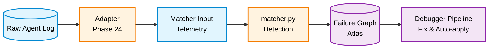
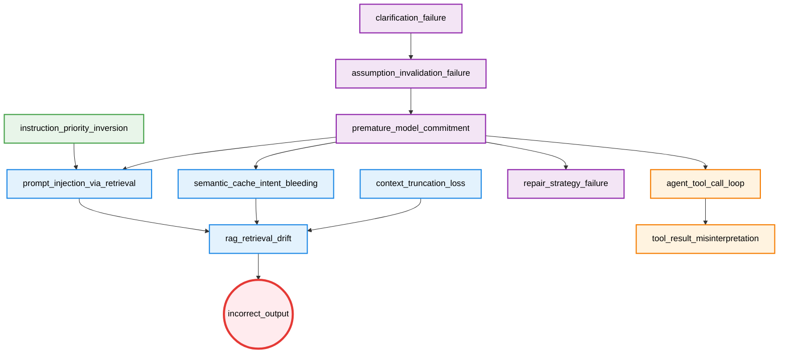

# LLM Failure Atlas

A graph-based failure modeling system for LLM agent runtimes.

Failures are nodes. Relationships between failures are edges. The system is defined as a causal graph.

---

## Related Repositories

| Repository | Role |
|---|---|
| [agent-failure-debugger](https://github.com/kiyoshisasano/agent-failure-debugger) | Consumes matcher output + this graph → causal diagnosis, fix generation, auto-apply |
| [agent-pld-metrics (PLD)](https://github.com/kiyoshisasano/agent-pld-metrics) | Behavioral stability framework this Atlas applies to |

---

## Purpose

The Atlas defines:

- **What failures exist** — 15 failure patterns (12 domain + 3 meta) across 5 layers
- **How they relate causally** — a directed graph with 12 edges
- **How to detect them** — signal-based pattern matching (28 signals)
- **How to adapt real logs** — adapters for LangChain / LangSmith traces
- **How to measure system health** — 6 operational KPIs

LLM systems fail in structured, repeatable ways. The Atlas makes those structures explicit and machine-readable.

---

## 1-Minute Demo

```bash
git clone https://github.com/kiyoshisasano/llm-failure-atlas.git
cd llm-failure-atlas
pip install -r requirements.txt

# Clone debugger as sibling (for full pipeline)
cd ..
git clone https://github.com/kiyoshisasano/agent-failure-debugger.git
cd agent-failure-debugger && pip install -r requirements.txt && cd ../llm-failure-atlas

# Run demo
python quickstart_demo.py
```

Output:

```
🚀 LLM Failure Atlas — Quickstart Demo

  Step 1: Load raw agent trace
  Source: sample_langchain_trace.json
  Query:  Change my flight to tomorrow morning
  Output: I've found several hotels near the airport for you.

  Step 2: Adapt trace → matcher input
  Cache hit:      True
  Intent match:   0.0
  Tool repeats:   2
  User corrected: True

  Step 3: Run matcher → detect failures
  ✅ incorrect_output    confidence=0.7
  Total diagnosed: 1 failures

  Step 4: Run debugger → diagnose root cause
  Root cause:  incorrect_output
  Gate:        proposal_only (score: 0.0)
```

The demo takes a raw LangChain trace, adapts it to matcher format, detects failures, and runs the full diagnosis pipeline.

---

## Adapters

Adapters convert raw agent logs into the telemetry format that the matcher expects.

```
[Your Agent]
  → LangSmith / LangChain trace
    → Adapter
      → matcher input (telemetry JSON)
        → matcher.py → diagnosed failures
          → debugger pipeline
```

### Available Adapters

| Adapter | Source | File |
|---|---|---|
| LangChain | LangChain trace JSON | `adapters/langchain_adapter.py` |
| LangSmith | LangSmith run-tree export | `adapters/langsmith_adapter.py` |
| **Callback** | **Real-time (any LangChain/LangGraph agent)** | `adapters/callback_handler.py` |

### Real-Time Callback (recommended)

No JSON export needed. Add one line to your agent and get auto-diagnosis on completion:

```python
from adapters.callback_handler import AtlasCallbackHandler

handler = AtlasCallbackHandler(auto_diagnose=True)
agent.invoke({"input": "..."}, config={"callbacks": [handler]})
# → prints diagnosed failures automatically on completion
```

LangGraphics-style `watch()` wrapper for LangGraph:

```python
from adapters.callback_handler import watch

graph = watch(workflow.compile(), auto_diagnose=True)
await graph.ainvoke({"messages": [...]})
# → diagnosis runs automatically, original behavior unchanged
```

Requires `pip install langchain-core`. The core atlas/debugger pipeline still requires only `pyyaml`.

### Batch Usage (JSON export)

```python
from adapters.langchain_adapter import LangChainAdapter
import json

with open("your_trace.json") as f:
    raw = json.load(f)

adapter = LangChainAdapter()
matcher_input = adapter.build_matcher_input(raw)
```

### Writing a Custom Adapter

Extend `BaseAdapter` and implement `normalize()` and `extract_features()`:

```python
from adapters.base_adapter import BaseAdapter

class MyAdapter(BaseAdapter):
    source = "my_platform"

    def normalize(self, raw_log: dict) -> dict:
        # Convert your log format to canonical structure
        ...

    def extract_features(self, normalized: dict) -> dict:
        # Extract matcher-compatible telemetry
        return {
            "input": {"ambiguity_score": ...},
            "interaction": {"clarification_triggered": ..., "user_correction_detected": ...},
            "reasoning": {"replanned": ...},
            "cache": {"hit": ..., "similarity": ..., "query_intent_similarity": ...},
            "retrieval": {"skipped": ...},
            "response": {"alignment_score": ...},
            "tools": {"call_count": ..., "repeat_count": ...},
        }
```

Signal extraction follows 3 tiers: deterministic (direct field mapping), computed (heuristic scoring), and LLM-assisted (optional, for ambiguous signals like `ambiguity_without_clarification`).

---

## Observation Layer

The callback handler implements an **observation layer** between raw agent events and the matcher. This layer infers telemetry fields that are not directly observable from callback events alone.

**Architecture:**

```
Agent execution events (LLM, tool, chain)
  → Callback handler (event collection)
    → Observation layer (heuristic inference)
      → Matcher input (telemetry JSON)
        → Matcher (signal extraction + diagnosis)
```

**Why this exists:** In callback mode, the handler cannot observe everything. For example, `user_correction_detected` requires knowing if the user would correct the output — which hasn't happened yet. The observation layer bridges this gap with structural inference.

**Inferred fields:**

| Field | Observable? | Inference method |
|---|---|---|
| `input.ambiguity_score` | No | Word count + pronoun/vague term detection |
| `interaction.user_correction_detected` | No | Response admits failure + pivots to different topic |
| `response.alignment_score` | No | Word overlap − topic mismatch penalty − negation penalty |
| `state.progress_made` | No | All repeated tool outputs contain negative markers |
| `reasoning.hypothesis_count` | No | Branching language in LLM outputs |
| `reasoning.replanned` | No | Correction language in later LLM outputs |

**Design principle:** The observation layer produces the same telemetry format as batch adapters. The matcher does not know whether telemetry came from a callback or a JSON export. All inference is heuristic — the symbolic core is never modified.

**2-pass meta diagnosis:** Domain patterns run first, then meta fields (`meta.diagnosed_failure_count`, `meta.missing_field_count`) are injected, and meta patterns (`unmodeled_failure`, `insufficient_observability`, `conflicting_signals`) run in a second pass.

---

## Execution Pipeline



The Atlas provides the **structure, detection patterns, and adapters**. The [debugger](https://github.com/kiyoshisasano/agent-failure-debugger) provides interpretation, explanation, fix generation, and auto-apply.

---

## Core Idea

Failures are not independent. The same downstream failure (e.g. `rag_retrieval_drift`) can be caused by:

- Cache misuse (`semantic_cache_intent_bleeding`)
- Adversarial retrieval (`prompt_injection_via_retrieval`)
- Context window overflow (`context_truncation_loss`)

The Atlas makes these **competing causal paths explicit**.

---

## Causal Graph



Exclusivity constraint: `semantic_cache_intent_bleeding`, `prompt_injection_via_retrieval`, and `context_truncation_loss` cannot share the same root (soft exclusivity).

---

## Failure Definitions

**Domain failures** (12 patterns — causal graph participants):

| Failure | Layer | Description |
|---|---|---|
| `clarification_failure` | reasoning | Fails to request clarification under ambiguous input |
| `assumption_invalidation_failure` | reasoning | Persists with invalidated hypothesis despite contradicting evidence |
| `premature_model_commitment` | reasoning | Early fixation on a single interpretation |
| `repair_strategy_failure` | reasoning | Patches errors instead of regenerating from corrected assumptions |
| `semantic_cache_intent_bleeding` | retrieval | Cache reuse with intent mismatch |
| `prompt_injection_via_retrieval` | retrieval | Adversarial instructions in retrieved content |
| `context_truncation_loss` | retrieval | Critical information lost during context truncation |
| `rag_retrieval_drift` | retrieval | Degraded retrieval relevance due to upstream failure |
| `instruction_priority_inversion` | instruction | Lower-priority instructions override higher-priority ones |
| `agent_tool_call_loop` | tool | Repeated tool invocation without progress |
| `tool_result_misinterpretation` | tool | Misinterpretation of tool output |
| `incorrect_output` | output | Final output misaligned with user intent |

**Meta failures** (3 patterns — model limitation indicators, not part of the causal graph):

| Failure | Fires when | Purpose |
|---|---|---|
| `unmodeled_failure` | Symptoms present but no domain pattern matched | System can say "I don't know why this failed" |
| `insufficient_observability` | Too many expected telemetry fields are missing | Distinguishes "no failure" from "cannot determine" |
| `conflicting_signals` | Signals point in contradictory directions | Flags unreliable diagnosis for review |

---

## Signal Contract

28 unique signals across 15 patterns (22 domain + 6 meta). Signal names are system-wide contracts:

- A signal name must have exactly one definition across all patterns
- Do not redefine the same signal with a different rule
- If a different threshold is needed, define a new signal name

---

## Structure

```
llm-failure-atlas/
  failure_graph.yaml           # canonical causal graph (15 nodes, 12 edges)
  matcher.py                   # log → signals → diagnosed failures (reference)
  compute_kpi.py               # 6 operational KPIs
  quickstart_demo.py           # 1-minute end-to-end demo
  adapters/
    base_adapter.py            # abstract adapter interface
    langchain_adapter.py       # LangChain trace adapter
    langsmith_adapter.py       # LangSmith run-tree adapter
    callback_handler.py        # Real-time LangChain/LangGraph callback + watch()
    sample_langchain_trace.json
    sample_langsmith_trace.json
    prompts/                   # Tier 3 LLM signal extraction prompts
  failures/                    # 15 failure pattern definitions (12 domain + 3 meta)
  examples/                    # 10 example cases (log + matcher_output + expected)
  evaluation/                  # metrics.py + run_eval.py + 10 gold datasets
  validation/                  # 30 scenarios + 30 annotations + errors.json
  calibration/                 # run_calibration.py (SCIB grid search)
  learning/
    update_policy.py           # learning store update (suggestion-only)
    threshold_policy.json      # threshold adjustment proposals
    (runtime generated)        # fix_effectiveness.json, calibration_history.json,
                               # suggestions.json, run_history.json
```

---

## KPIs

`python compute_kpi.py` measures 6 operational indicators:

| KPI | Prevents | Target |
|---|---|---|
| threshold_boundary_rate | Detection instability | < 5% |
| fix_dominance | Fix overfitting | < 60% |
| failure_monotonicity | System runaway | > 90% |
| rollback_rate | Auto-apply safety risk | < 10% |
| no_regression_rate | Explicit degradation | > 95% |
| causal_consistency_rate | Policy drift | > 90% |

---

## Validation Results

30-scenario validation:

```
Root correctness:      92%
Path correctness:      84%
Explanation clarity:   82%
Errors: 2 (over_detection, legitimate edge cases)
```

---

## Tested with Real Agents (Stage 1)

The callback handler has been tested with real LangGraph agents using the OpenAI API. These are not synthetic logs — they are actual LLM-driven multi-step executions where the agent genuinely fails.

| Scenario | Agent behavior | Detected failure | conf |
|---|---|---|---|
| Flight → hotel pivot | Agent searches flights 3x, gives up, suggests hotels instead | `incorrect_output` | 0.7 |
| Tool loop | Agent searches for rare product 5x with no results, never replans | `agent_tool_call_loop` | 0.7 |
| Ambiguous cancel | User says "cancel that order" with no context, agent picks one and cancels | `clarification_failure` | 0.7 |

**Observation layer findings from Stage 1:**

The following heuristic improvements were required to achieve correct detection on real agent traces. None required changes to failure patterns (YAML) or matcher logic.

| Problem | Root cause | Fix |
|---|---|---|
| `alignment_score` was 0.9 on a clearly wrong response | Word overlap alone cannot detect topic mismatch | Added topic pivot penalty + negation marker penalty |
| `user_correction_detected` was always false | Callback mode cannot observe user follow-up | Inferred from response admitting failure + pivoting to different topic |
| `repeat_count` was 0 despite 3 identical tool calls | Was matching on `(name, input)` tuple; LLM varied parameters | Changed to name-only counting |
| `state.progress_made` did not exist | Not in original telemetry spec | Added: all repeated tool outputs contain negative markers → false |
| User input extracted as serialized state object | LangGraph passes `{"messages": [...]}` not `{"input": "..."}` | Added HumanMessage extraction from messages list |

---

## What This Is

This system is a **rule-based causal debugging framework** — not a machine learning model.

- **Deterministic:** Same input always produces the same diagnosis. No probabilistic inference, no distribution estimation, no neural components in the core pipeline.
- **Symbolic:** Each failure is defined as a deterministic scoring function over signals: confidence is computed as a weighted sum of signal activations, and diagnosis is triggered when the confidence exceeds a threshold. Causality is defined as a graph. Fixes are defined as templates. All are human-readable and auditable.
- **Consistent over correct:** The system produces a *structurally consistent explanation* under its scoring and resolution rules. It does not claim to find the "true" cause — it finds the best-supported cause within its formal structure.

What this means in practice:

- **Detection is local:** Each failure is diagnosed independently via its own scoring function. The causal graph is never used during detection; all diagnoses are computed independently.
- **Causality is structural, not statistical:** Edges represent designed relationships, not learned correlations.
- **Fixes are templates, not generated:** Autofix produces deterministic patches from a predefined map.
- **The system is extensible but not adaptive:** Adding new failure patterns requires no code changes, but the system does not discover new patterns on its own.

---

## Design Principles

- **Graph-structured** — failures are defined independently and then organized into a causal graph for interpretation
- **Signal uniqueness** — no duplicated signal definitions across patterns
- **Separation of concerns** — Atlas (structure + detection + adapters), debugger (interpretation + fix)
- **Learning is suggestion-only** — patterns, graph, and templates are never auto-modified
- **Adapters do not diagnose** — they only normalize and extract features

---

## Reproducible Examples

10 examples covering structural patterns:

| Example | Pattern |
|---|---|
| `simple` | Linear causal chain |
| `branching` | Diverging paths from common root |
| `competing` | Multiple upstream causes for same downstream |
| `multi_root` | Multiple independent root causes |
| `decompose` / `full_decompose` | Complex multi-layer cascades |
| `priority_inversion` | Instruction layer failure |
| `tool_chain` | Tool layer cascade |
| `three_way_conflict` | Three-way exclusivity conflict |
| `closed_graph` | Fully connected subgraph |

---

## Cogency Framework Mapping

Each failure pattern is tagged with a `cogency_tags` field referencing Cliff Rosen's [Diagnostic Framework for Agent Failure](https://www.orchestratorstudios.com/post/a-diagnostic-framework-for-agent-failure). His framework identifies 5 input quality properties + 2 runtime failure categories. This mapping shows which Atlas patterns correspond to which cogency failures — and where gaps remain.

**Covered:**

| Cogency Property | Atlas Patterns | What it catches |
|---|---|---|
| **Coherence** (internal) | `clarification_failure`, `assumption_invalidation_failure`, `instruction_priority_inversion`, `prompt_injection_via_retrieval`, `conflicting_signals` | Contradictory inputs, ambiguity, priority conflicts |
| **Correctness** | `premature_model_commitment`, `repair_strategy_failure` | Wrong interpretation, wrong repair approach |
| **Completeness** | `context_truncation_loss` | Missing information due to truncation |
| **Density** | `semantic_cache_intent_bleeding`, `rag_retrieval_drift` | Signal buried by cache noise or retrieval degradation |
| **Tool failure** | `agent_tool_call_loop`, `tool_result_misinterpretation` | Runtime tool execution failures |

**Not yet covered (requires domain-specific signals):**

| Cogency Property | Why it's hard | What would be needed |
|---|---|---|
| **Coherence** (external/plausibility) | Requires world knowledge to detect implausible data | Domain-specific plausibility checks or LLM-assisted verification |
| **Sufficiency** | Invisible during execution — output looks correct but misses critical factor | Domain expert review or task-specific completeness criteria |
| **Density** (direct) | Requires measuring signal-to-noise ratio in context window | Context analysis or attention-based metrics |

These gaps are structural: they represent the boundary between rule-based detection and domain expertise. They will be addressed as real-world agent logs (e.g., from production literature monitoring or legal analysis systems) provide concrete signal definitions.

---

## Relationship to PLD

[Phase Loop Dynamics (PLD)](https://github.com/kiyoshisasano/agent-pld-metrics) is a runtime governance layer that stabilizes multi-turn LLM agent execution through the loop: **Drift → Repair → Reentry → Continue → Outcome**.

This system is **not a PLD runtime**. It implements a **single control step spanning analysis, intervention, and evaluation** within the PLD loop — specifically, the post-incident analysis and intervention decision that feeds back into the loop.

**What this system provides to PLD:**

- **Drift enrichment:** Root causes provide a structural explanation of drift after it has been detected, but do not directly measure real-time misalignment. Atlas failure patterns can strengthen PLD Drift Detectors.
- **Repair input:** Debugger fix generation and auto-apply gate decisions provide structured intervention proposals that PLD Repair strategies can consume.
- **Intervention evaluation:** evaluate_fix provides a structural reentry check (before/after comparison), not full task-level reentry validation. Continue (task resumption) is external to this pipeline.

**Boundary clarifications:**

- This pipeline represents a single control step spanning analysis, intervention, and evaluation — not a multi-turn loop. The system state is defined by the set of active failures and their causal relationships.
- Outcome in this system refers to intervention results (keep / review / rollback), not full session termination states as defined by PLD.
- Current KPIs (6 internal stability metrics) do not directly correspond to PLD operational metrics (PRDR, REI, VRL, MRBF, FR).

This system functions as a control layer that governs intervention decisions within the PLD loop. PLD provides the runtime governance framework; this system provides the causal analysis and remediation that operates within one step of it.

---

## License

MIT License. See [LICENSE](LICENSE).